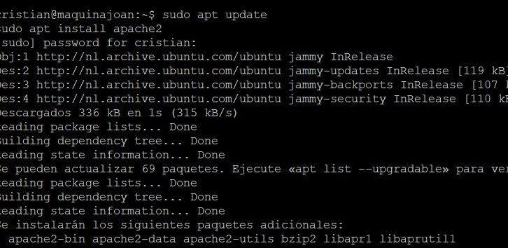
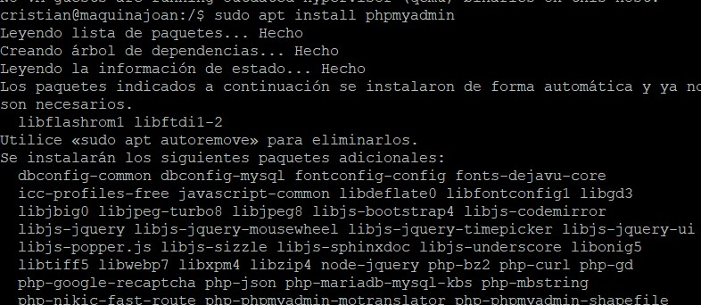
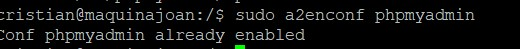
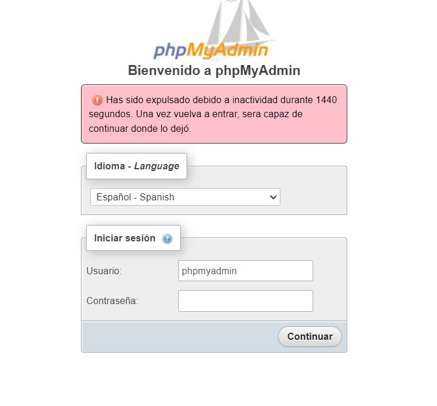
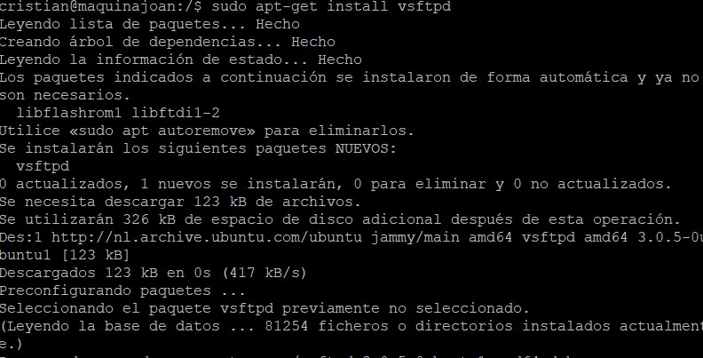
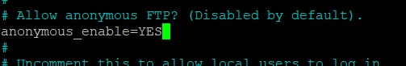
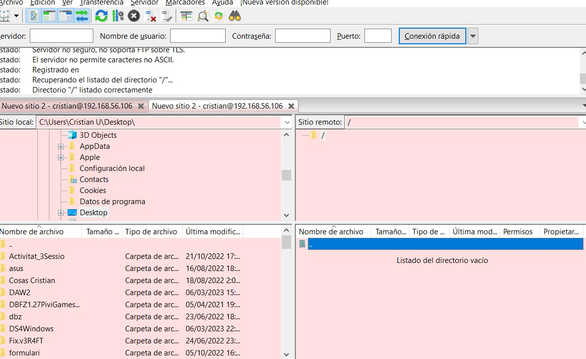

# Urquieta-MP08-UF03-A10

## INSTALACIO LAMP

**Començem amb l'instalacio del mysql-server**

**Amb aquesta comanda instalem el php**

**Un cop ho tenim tot instalat fem un restart del nostre servei**

**Comprovem que funciona al php buscant el nostre navegador la nostra ip i /phpinfo.php**

## INSTALACIO PHPMyAdmin

**Per si acas tornem a actualizar en nostre sistema en cas de que per culpa de que no tinguem actualizat tots els paquets pugi aver-hi un problema per falta de paquets**

**Instalacio phpmyadmin, quan ha demanat introduir la contrasenya se m'ha oblidat fer-li captura pero com contraseña hem ficat 1234**

**Habilitem el modul phpmyadmin**

**Fem un restart del servei perque tots els cambis que hem fet es pugin aplicar correctament**

**Comprovem que esta tot instalat i funcionant, el usuari es phpmyadmin amb contraseña 1234**

## INSTALACIO FTP

**Instalem el servidor ftp amb el segunt comanda**

**Un cop tenim aquest servei tenim que accedir-hi al arxiu de configuracio on tinderm que activar aquestes opcions write_enable=YES anonymous_enable=YES**

**Restart del servei per els canvis que hem fet**

**Podem entrar amb el nostre usuari de Sistema Operatiu, pero encara falta configurar que ens posi directament al directori /home**

