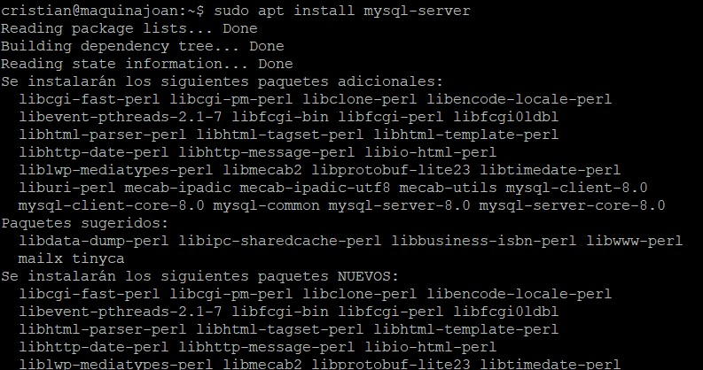
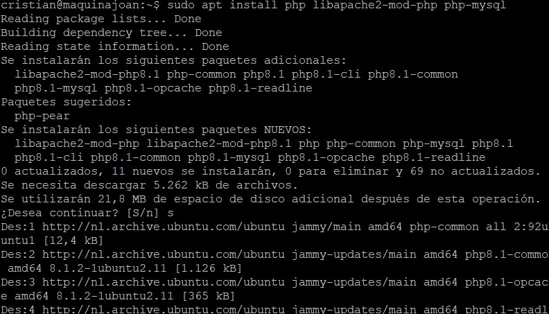
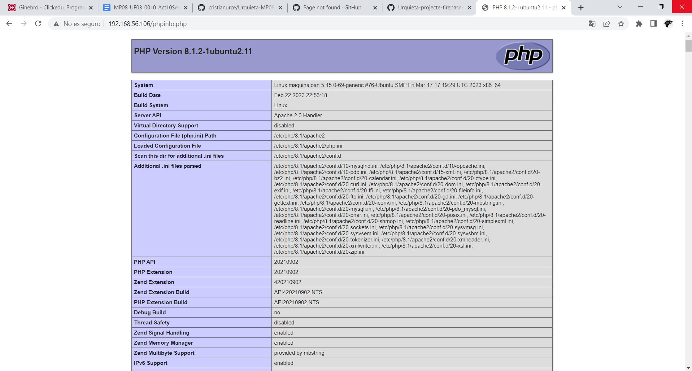

# Urquieta-MP08-UF03-A10

**Començem amb l'instalacio del mysql-server**

**Amb aquesta comanda instalem el php**

**Un cop ho tenim tot instalat fem un restart del nostre servei**

**Comprovem que funciona al php buscant el nostre navegador la nostra ip i /phpinfo.php**
